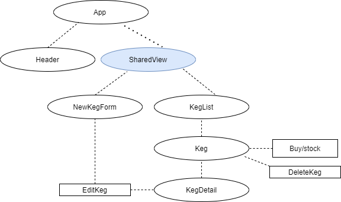

# 
Tap House

     
    

  <small>Last Updated: February 12th, 2021</small>

# ℹ️ Description

A React site used to track Keg availability and selection!

# 📸 Component Diagram

# 🧑‍💻 Contributers

| Name | GitHub Profile |
|------|----------------|
| [Ryland Adams](https://www.linkedin.com/in/rylandadams/) | [Pugsly99](https://github.com/Pugsly99)|
# ⚙️ Technologies Used

* <a href="https://code.visualstudio.com/">Microsoft Visual Studio Code</a>
* <a href="https://github.com/">Git/GitHub</a>
* <a href="https://reactjs.org/">ReactJS</a>
* <a href="https://developer.mozilla.org/en-US/docs/Learn/CSS">CSS</a>
* <a href="https://getbootstrap.com/">Bootstrap</a>

# 💾 Installation Requirements

## For Both Mac & Windows systems

#### To Clone:
- Open your preferred command line program.
- Navigate to the location or directory you'd like the project directory to be created in. (e.g., "cd Desktop" if you'd like to clone the project to your desktop)
- Enter the command "$ git clone https://github.com/Pugsly99/tap-house" in your command line.

#### To Download:
- Navigate to the [project repository](https://github.com/Pugsly99/tap-house) in your browser.
- Click the green "Code" button toward the top right of the page.
- Click "Download ZIP" and extract the files.
- Open the newly-downloaded project in your preferred code editor.

# 🖥️ Opening the Project on your Local System

Once the project has been cloned and you have all the necessary items on your local computer, open the project in the application of your choice (<a href="https://code.visualstudio.com/">Visual Code Studio</a> was used and is recommended by the application builder)

### Run the project:

# ☎️ Support / Contact Details

* [Ryland Adams](mailto:rylandadams@yahoo.com)

# 🐛 Bugs / Issues

| Date | Error | Handled | Solution |
| :------------- | :------------- | :------------- | :------------- |
|  |  | ✅  |  |

# ©️ License & Copyright

Copyright (c) 2021 *_Ryland Adams_*
